# Bayesian Kriegspiel Chess Agent

## Abstract
Kriegspiel is a chess variant with incomplete information. Players do not see their opponent’s pieces; instead, an umpire informs them of certain events (e.g., captures, checks, illegal moves). We developed a goal-based Bayesian agent for Kriegspiel that tracks a belief state of all possible piece positions and updates these beliefs based on conditional probability tables (CPTs) and the umpire’s announcements. Our agent selects moves using Stockfish on the most probable board configuration.

Following is the PEAS breakdown of the agent:
- _Performance_: Measured by the ratio of wins/draws/losses compared to a baseline random Kriegspiel bot.  
- _Environment_: The Kriegspiel chess environment, with incomplete information and an umpire providing partial feedback.  
- _Actuators_: The agent’s moves (like standard chess moves) submitted to the umpire.  
- _Sensors_: Umpire announcements (for both the opponent’s and the agent’s own moves), including illegal moves, captures, or checks.

We chose Kriegspiel for a Bayesian agent because the uncertainty in the board state naturally lends itself to probabilistic modeling. Our approach maintains a set of plausible board configurations (belief states) and updates their likelihood using:
1. Opponent move feedback (captures, checks, etc.)
2. Agent move feedback (illegal moves, checks, etc.)

Since belief states can grow exponentially ([reference paper](https://cdn.aaai.org/Symposia/Spring/2007/SS-07-02/SS07-02-003.pdf)), we apply heuristics, weighting, and frequent pruning to keep computations feasible.

---

## Installation
1. Clone this repository:
   ```bash
   git clone https://github.com/cheung-arthur/ursofanumtax.git
   ```
2. Create a conda environment:
   ```bash
   conda create -n kriegspiel_env python=3.9
   ```
3. Activate the conda environment:
   ```bash
   conda activate kriegspiel_env
   ```
4. Install dependencies:
   ```bash
   pip install -r requirements.txt
   ```
5. Install Stockfish  
   [Download or install Stockfish](https://stockfishchess.org/download/) for your system.  
   On macOS with Homebrew, for example:
   ```bash
   brew install stockfish
   ```
   
---

## Usage

1. Run the Agent  
   ```bash
   python src/main.py <stockfish_path>
   ```
   - `stockfish_path` defaults to `"/opt/homebrew/bin/stockfish"` (typical for a Homebrew install on macOS).

2. Evaluate the Agent  
   ```bash
   python src/evaluate.py <number_of_games>
   ```
   - `number_of_games` defaults to `100` if not provided.

---

## Data Exploration and Preprocessing
We use a dataset of _16,657 Kriegspiel games_ compiled from various internet sources by UMD:  
[https://chess.cs.umd.edu/kriegspiel/download.html](https://chess.cs.umd.edu/kriegspiel/download.html)

A sample game from the dataset might look like:

```
[Event "ICC w16 1 0"]
[Site "Internet Chess Club"]
[Date "1999.12.12"]
[White "dyscr33t"]
[Black "Tortoise"]
[Result "0-1"]
[ICCResult "White checkmated"]
[WhiteElo "1977"]
[BlackElo "1653"]
[Time "23:59:56"]

1. g4 Nh6 2. g5 g6 3. gxh6 Bxh6 4. Nc3 Bg7 ...
... 
37. Qf8+ Kh7 38. Bh5 Qxc2#
{White checkmated}
0-1
```

During preprocessing, we filtered out invalid games that contained illegal or unrecognized moves, such as:

```
illegal san: 'Bxe7'
illegal san: 'Bxd2'
illegal san: 'Ke7'
illegal san: 'Bxh3'
invalid san: 'P@g4'
invalid san: 'B@e1'
...
```

These were excluded from the training set.

From the valid games, we compute prior probabilities of each piece (e.g., white pawn, black knight) being on each of the 64 squares, creating Conditional Probability Tables (CPTs). These serve as a baseline model of how likely a certain position is, given partial information.

We generated heatmaps for all 12 piece-color combinations (White Pawn, White Knight, …, Black King) to visualize these probabilities. These heatmaps appear in our documentation and illustrate how frequently pieces occur on certain squares from the training data.

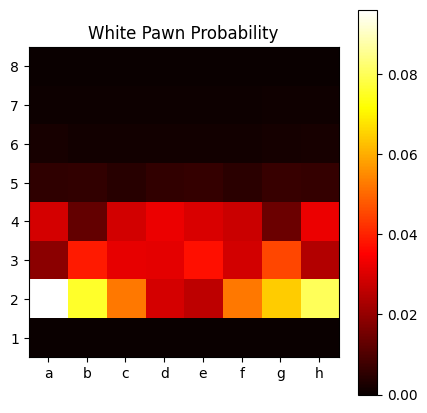 | 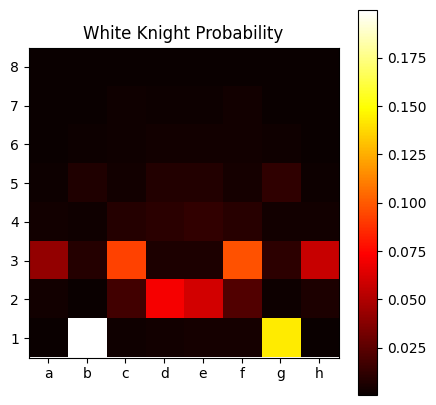
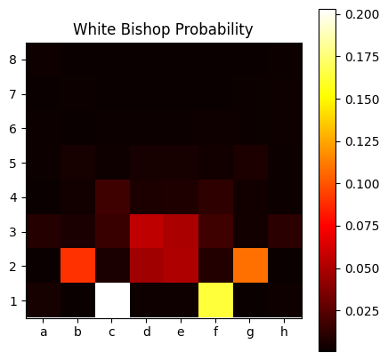 | 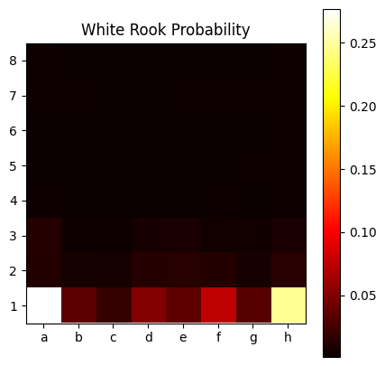
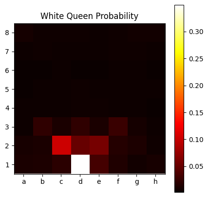| 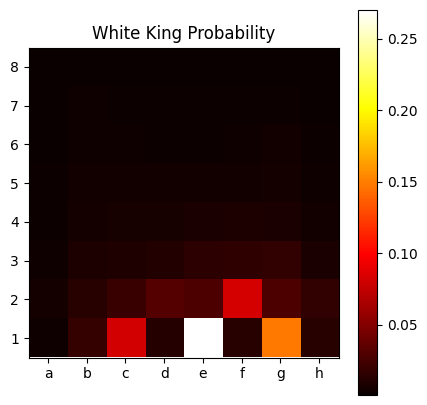
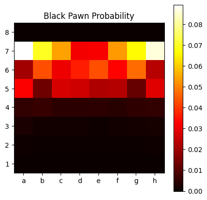 | 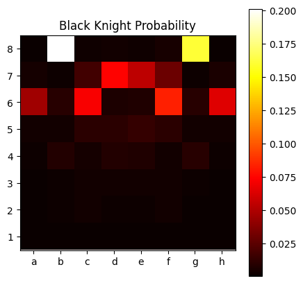
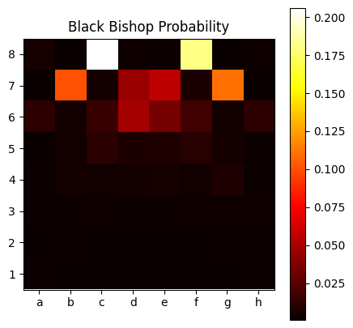 | 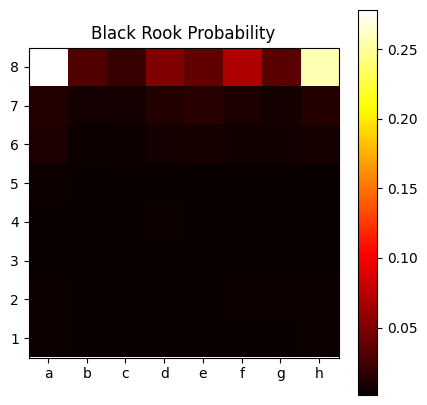
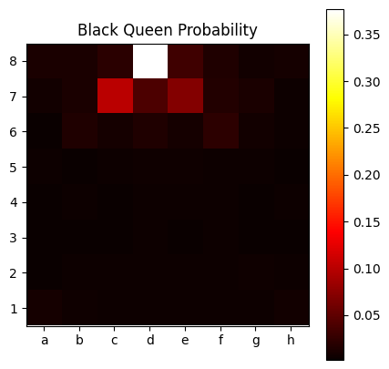 | 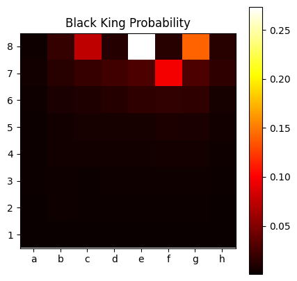

---

## Training
We provide a Jupyter notebook (`data/exploration.ipynb`) that:
1. Loads and cleans the dataset (removing invalid games).  
2. Computes the CPTs and prior probabilities for each piece on each square.  
3. Saves the result to `belief_states_cpts.pkl`.

Our agent then loads these CPTs at runtime and uses them to:
1. Initialize belief states (possible board configurations).  
2. Update or prune states whenever the opponent or agent makes a move and the umpire announces relevant events.  
3. Choose the best move using Stockfish on the highest-weighted board configuration.

---

## Evaluation
To evaluate our Bayesian Kriegspiel agent, we compare it against a baseline random Kriegspiel bot (`src/random_player.py`). This bot simply chooses from all legal moves uniformly at random.

We tested over _1,000 games_ and obtained:

```
Wins: 174
Draws: 772
Losses: 54
```

- Win/Loss Ratio = 174 : 54 ≈ **3.22**

The high number of draws reflects the incomplete-information nature of Kriegspiel, where both players often struggle to create decisive threats without a clear view of the board. Games can also become very long (up to 700 moves) before a threefold repetition or other drawing mechanism concludes them.

---

## Conclusion
Our results show a moderate win/loss ratio against a random bot, but a very large proportion of draws. This suggests that more sophisticated strategies are needed to exploit the limited information environment:

1. More Complex CPTs  
   - Refine probability distributions using more context from the training data (e.g., piece coordination, typical opening distributions).
2. Particle Filters / MCTS  
   - Use particle filtering to sample the space of belief states more efficiently.  
   - Apply Monte Carlo Tree Search (MCTS) on partial information states to explore future possibilities more strategically.
3. Search Optimization  
   - Prune improbable board configurations more aggressively.  
   - Integrate domain-specific knowledge (e.g., certain piece positions are unlikely in typical mid-/endgame scenarios).

With these enhancements, we hope to further reduce the draw rate and increase the agent’s overall performance in future iterations.