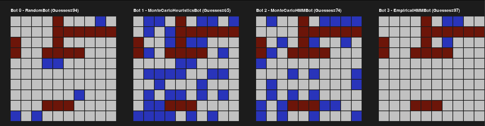
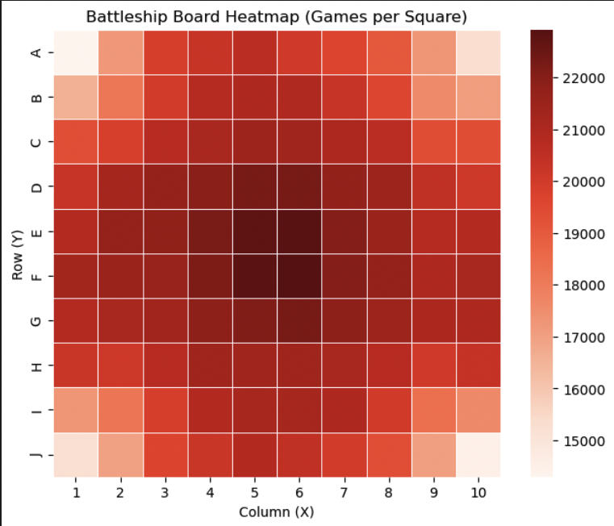

# Probabilistic Battleship (Attack) Agents

## Abstract
Battleship is a well-known strategy type guessing game, wherein 2 players first place their ships on their own 10x10 grid. Players the alternate turns "attacking"(guessing) a coordinate. Depending on whether (part of) an opponent's ship is placed at that coordinate, "hit", "miss", or "hit and sink" is announced by the opponent. For simplicity sake, we will not require our agents to particpate in the inital "planning" phase of their own boards, but rather select a random configuration/layout of ships from the set of all valid configurations, and observe the number of guesses it takes each model to completely sink all ships in that configuration.

Following is the PEAS breakdown of the agent:
- _Performance_: Measured by the number of guesses it takes to sink all ships, compared to a random baseline battleship bot (100 being the worst, essentially brute-forcing a 10x10 grid)
- _Environment_: The 10x10 battleship grid, with a randomly selected configuration of the standard ships of lengths ```[5,4,3,3,2]```. 
- _Actuators_: The agent’s coordinate guess
- _Sensors_: The game engine provides "hit", "miss" or "hit and sink" feedback at each guess.

We provide multiple strategies:
- RandomBot – Guesses randomly among all unknown cells used as a baseline.
- MonteCarloHeuristicsBot – Uses a Monte Carlo simulation to generate valid board configurations consistent with known hits and misses, then chooses cells with the highest likelihood.
- MonteCarloHMMBot – Maintains a set of sampled board layouts (via a Hidden Markov Model–inspired particle filter) and updates/discards layouts based on feedback (hit, miss, sunk).
- EmpiricalHMMBot – Incorporates historical “heatmap” data of common ship placements (from data/battleship_game_squares.csv) to weight guesses in addition to an HMM-based approach.

## Agent In-Depth Descriptions & Motivation

**MonteCarloHeuristicsBot (Core Model)**

In Battleship, the primary challenge is that the opponent’s ship positions are unknown, and each new hit/miss reduces the set of plausible placements. A Monte Carlo simulation naturally fits this because:
1. It generates many board configurations that agree with known hits, misses, and ship placement rules.
2. It estimates probabilities by counting how often a particular cell is occupied by a ship across all consistent configurations.
3. Sampling from the large space of potential layouts is often simpler than enumerating them all (which can be combinatorially huge).

In this way, MonteCarloHeuristicsBot efficiently narrows down which cells are most likely to hold a ship—similar to how people often guess based on partial hits and typical ship patterns.

**MonteCarloHMMBot**

Battleship can be framed as a partially observable environment: the agent only knows hits, misses, and when a ship is sunk, but not the entire hidden configuration. A Hidden Markov Model (HMM)–inspired approach:

1. Tracks a “belief state” over possible boards (akin to the “hidden states” in an HMM).
2. Updates these states’ likelihoods after each hit/miss/sunk observation (like a forward pass in an HMM).
3. Resamples or prunes states that conflict with the new evidence (similar to particle filtering).

By treating each board layout as a “hidden” state, the MonteCarloHMMBot systematically refines its guesses after each move, which is a principled Bayesian way to handle partial information in Battleship.

**EmpiricalHMMBot**

Many people and AI bots have prior “intuitions” about where ships most commonly appear. This agent:

1. Starts with an HMM approach that samples possible layouts.
2. Weights each cell by how frequently it was occupied in historical data (the “heatmap”).
3. Combines the updated HMM probability for each cell with the empirical usage frequency.

Essentially, it marries real-time Bayesian updating with a data-driven “prior” about typical ship placements. Battleship can benefit greatly from learned priors—for example, players often avoid clustering large ships near edges or corners. Hence, an empirical frequency map can tip the bot toward or away from guessing certain cells first, augmenting the purely synthetic approach in a more realistic or experience-driven way.

---

## Installation
1. Clone this repository:
   ```bash
   git clone https://github.com/cheung-arthur/ursofanumtax.git
   ```
2. Create a conda environment:
   ```bash
   conda create -n battleship_env python=3.9
   ```
3. Activate the conda environment:
   ```bash
   conda activate battleship_env
   ```
4. Install dependencies:
   ```bash
   pip install -r requirements.txt
   ```
   
---

## Usage

1. Run the Agent(s) 
   ```bash
   python main.py <agents_to_run>
   ```
   - For example, ```python main.py random,montecarlo,montecarlohmm,hmm``` will run all 4 bots for a randomly selected ship configuration.


2. Run the Agent(s) with a PyGame GUI
   ```bash
   python main.py gui <agents_to_run>
   ```
   - For example, ```python main.py random,montecarlo,montecarlohmm,hmm``` will open a PyGame window to display all 4 bots as they run for a randomly selected ship configuration:
   - 

3. Evaluate the Agent  
   ```bash
   python evaluate.py <number_of_games>
   ```
   - `number_of_games` defaults to `100` if not provided.
   - All 4 agents are always evaluated

---

## Data Exploration and Preprocessing (only for empirical HMM model)
We use a dataset of _2,030,021 battleship games_ publically provided by _cliambrown_ on GitHub:  
[https://github.com/cliambrown/battleship-data](https://github.com/cliambrown/battleship-data)

The data was obtained by games played by users on _cliambrown_'s battleship website, as well as games played by AI models _cliambrown_ created.

During preprocessing in this exploration notebook, we load the raw CSV data and then combine (or “group”) all rows that refer to the same board square so that we can analyze them as one aggregated entry. 

The dataset contains multiple rows for the same squares—this usually happens when the data includes different conditions, runs, or configurations that nonetheless map back to the same physical position on the board. 

By grouping these rows by the square value and summing (or otherwise aggregating) the “games” column, we collapse duplicates into a single row per square. This grouping step allows us to create a concise representation of how many times each square was played across all conditions, which we then reshape into a 10×10 matrix for heatmap visualization.

Note that in our exploration, we found no unfilled cells, so there was no need for filtering or cleaning.

As a culmination of our data exploration that we would use in our ```empirical_hmm_bot```, we generated a heatmap for all 100 coordinates on a battleship to visualize these probabilities. This heatmap appears in our documentation and illustrate how frequently ships occur on certain squares from the training data.




---
## Training (for the Empirical HMM Model)

We provide a Jupyter notebook (`data/exploration.ipynb`) that handles the offline “training” portion for our EmpiricalHMMBot. Specifically, this notebook:

1. **Loads and Cleans the Dataset**  
   We read in `battleship_game_squares.csv` (aggregated from the raw dataset). Any duplicate entries for the same square are grouped together, summing the number of games. Invalid entries (if any) would be filtered out here.

2. **Computes Probability / Frequency Values**  
   - We interpret the `games` column as the frequency of ships being placed on each square across all recorded games.
   - We normalize these frequencies or store them directly for later use. Essentially, these become our prior probabilities: “How likely is a ship to occupy a given square based on historical data?”

3. **Exports / Saves Results**  
   The final aggregated frequencies (or probabilities) are either kept in CSV form (`battleship_game_squares.csv`) or saved into a matrix form. This lets the EmpiricalHMMBot quickly load the data at runtime without reprocessing the entire raw dataset.

Within the bot’s code (see `empirical_hmm_bot.py`), we have: 

```python
df = pd.read_csv(self.csv_path)
# sum 'games' by square, reshape into 10x10, etc.
data_array = np.flipud(data_array)
```
This snippet directly reads the processed CSV and creates a 10×10 array reflecting real-world usage frequencies. Thus, while there’s no “training” in the typical supervised-learning sense, this step defines the empirical prior that our HMM-based approach uses.

---
## Training HMM Model (Implementation Details)
Although the EmpiricalHMMBot uses a static frequency map (rather than iteratively learning parameters during gameplay), we still describe this as “training” in the sense of preparing model parameters:

- Bayesian Update Logic: The HMM portion updates each turn by re-weighting or discarding candidate ship configurations that conflict with new observations (“hit,” “miss,” “hit and sunk”).

- Combining Empirical Frequencies: After calculating the updated HMM marginal probabilities, we multiply each cell’s HMM probability by its empirical frequency. This yields a final “weighted” probability map that tends to favor cells historically shown to contain ships more often.

---


## Evaluation
To evaluate our Battleship agent, we compare it against a baseline random battleship bot (`battleship/random_bot.py`). This bot simply chooses from all legal configurations uniformly at random.

We tested over _100 games_ and obtained (see `fig/evaluation_results.png`):

| **Agent**                 | **Avg # of Guesses** |
|---------------------------|-----------------------|
| **MonteCarloHeuristicsBot** | 60.89                |
| **MonteCarloHMMBot**      | 94.38                |
| **EmpiricalHMMBot**       | 93.78                |
| **RandomBot**             | 95.67                |

### Interpretation

- **MonteCarloHeuristicsBot** led the field, averaging ~60.9 guesses. Its strategy of sampling valid ship layouts and guessing cells most frequently occupied proved effective.
- **MonteCarloHMMBot** and **EmpiricalHMMBot** both averaged in the low- to mid-90s for guesses. Despite employing Bayesian/particle-filter approaches, these runs did not outperform the simpler MonteCarloHeuristicsBot in this particular test setup. Potential causes may include undersampling or certain assumptions in the HMM logic.
- **RandomBot**, as expected, performed the worst with ~95.7 guesses on average, underscoring how naive random guessing yields more than half the board guessed before success.

Because Battleship is a finite but large search space, small implementation details (e.g., sampling sizes, how hits/sinks are processed, or the chosen random seed) can significantly affect results. Overall, these tests suggest that a carefully tuned Monte Carlo heuristic can significantly outperform random guessing, but there is room to refine the HMM-based approaches to match or exceed that performance.

---

## Conclusion 

Our results show that **MonteCarloHeuristicsBot** outperforms the other bots in terms of average number of guesses needed to sink all ships (about 60.9 guesses across 100 simulations). In contrast, both **MonteCarloHMMBot** and **EmpiricalHMMBot** required around 94 guesses on average, performing only slightly better than the **RandomBot** baseline at 95.7 guesses.

One likely explanation for the lower-than-expected performance of the two HMM-based bots is the **combinatorially large set of possible board configurations**. Even just placing the standard ships `[5, 4, 3, 3, 2]` on a 10×10 grid results in an enormous search space. We currently **limit ourselves to 2,000 sampled configurations** (`sample_count=2000`) in the code (`hmm.py` and the HMM-based bots). This relatively small sample size may fail to capture many relevant layouts, especially once additional evidence (hits/misses) begins to constrain the board. Hence, the sampling-based inference may struggle to converge on the highest-probability states.

Below are some key takeaways:

- **Heatmaps (Empirical Data)**: We introduced a 10×10 usage frequency map for `EmpiricalHMMBot`, derived from a real-world dataset of over 2 million games. While this adds a strong prior for some squares, the poor performance relative to MonteCarloHeuristicsBot suggests that either our Bayesian update is too coarse or the limited sample count in the HMM overshadowed any gains from the empirical prior.
- **Comparison to Random**: The random bot’s ~95.7 guesses show that naive guessing is fairly inefficient. While both HMM-based bots hover near this number, it indicates that improvements in sampling and update strategies are likely needed.
- **Interpretation**: Battleship remains challenging because the feedback (hit/miss/sunk) only slowly reveals the ship placements. Reliance on a small sample count (2,000) can lead to a wide mismatch between the “true” placement distribution and the “particle-filter” distribution we use. By contrast, MonteCarloHeuristicsBot performs more direct sampling each turn without the overhead of maintaining or pruning states over time, and that simpler approach seems to capture crucial constraints effectively.

### Potential Improvements
1. **Increase the Number of Samples**: Raising `sample_count` in the HMM-based approaches from 2,000 to, say, 10,000 or more could allow for a more fine-grained representation of likely ship layouts.
2. **Adaptive Resampling**: Instead of a static sample size, we could adaptively increase samples when more constraints (hits/misses) appear, so the probability mass is better approximated.
3. **Advanced Constraint Logic**: HMM states could consider additional heuristics or constraint checks (e.g., no ships may be adjacent diagonally if that’s a rule variant) to narrow the search space.
4. **Refined Empirical Integration**: Rather than a simple multiplication of the HMM and empirical heatmaps, a more nuanced Bayesian integration—possibly reweighting states at initialization or implementing an iterative readjustment—could improve performance.
5. **Data Bias & Filtering**: Real-world datasets may have biases (e.g., player preferences for certain placements). We could study whether rebalancing or filtering the dataset yields a better prior distribution.

Overall, while the HMM-based bots did not achieve top performance in these tests, they still demonstrate an approach that can be enhanced with additional sampling, refined constraints, or improved data integration. The **MonteCarloHeuristicsBot**’s strong results highlight how focusing on feasible ship placements each turn can be both conceptually simpler and more effective under our current constraints.

## Acknowledgements
- _cliambrown_ on Github provided the framework and psuedocode for the Heuristic Model [here](https://cliambrown.com/battleship/), as well as the dataset for which we used to trian our empirical HMM model.
